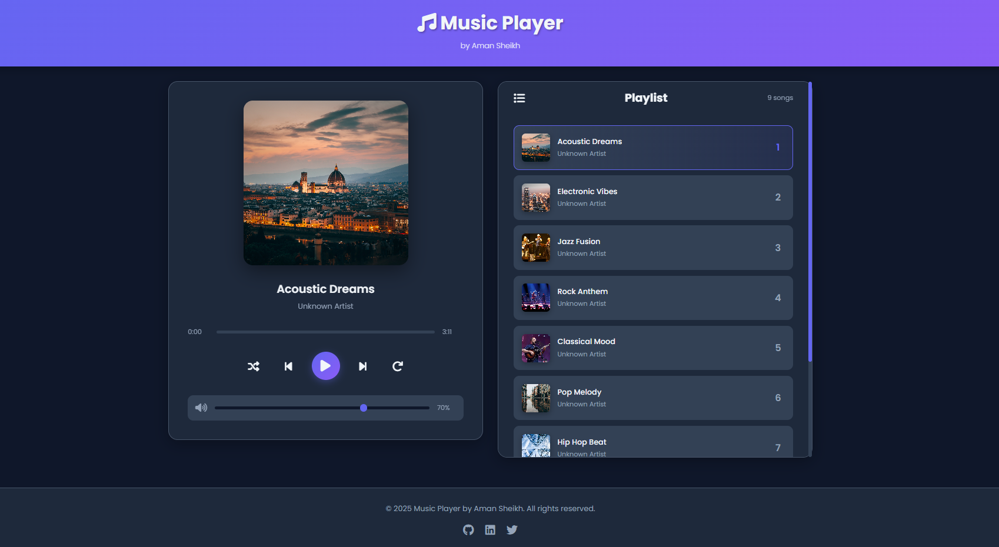

# 🎵 Music Player

A modern, feature-rich music player built with vanilla JavaScript, HTML5, and CSS3. This project showcases a beautiful and responsive user interface with advanced music playback controls.



Deployed Link --> https://celadon-caramel-5c2c2a.netlify.app/


## ✨ Features

### 🎼 Core Features

- **Play/Pause Control** - Smooth audio playback with visual feedback
- **Next/Previous Track** - Navigate through your playlist easily
- **Progress Bar** - Seek to any position in the song with a single click
- **Volume Control** - Adjust volume with an intuitive slider (0-100%)
- **Time Display** - Shows current time and total duration

### 🎨 Advanced Features

- **Shuffle Mode** - Random playback order
- **Repeat Modes** - Cycle through: Off → Repeat All → Repeat One
- **Visual Feedback** - Rotating album art when playing
- **Active Track Highlighting** - Easy identification of current song
- **Playlist View** - Browse all available songs with thumbnails
- **Auto-scroll Playlist** - Active song stays visible

### ⌨️ Keyboard Shortcuts

| Key      | Action                  |
| -------- | ----------------------- |
| `Space`  | Play/Pause              |
| `→`      | Seek forward 5 seconds  |
| `←`      | Seek backward 5 seconds |
| `↑`      | Increase volume by 10%  |
| `↓`      | Decrease volume by 10%  |
| `Ctrl+N` | Next song               |
| `Ctrl+P` | Previous song           |
| `Ctrl+S` | Toggle shuffle          |
| `Ctrl+R` | Toggle repeat mode      |

### 📱 Responsive Design

- Fully responsive layout
- Mobile-friendly touch controls
- Optimized for all screen sizes (320px - 4K)
- Smooth animations and transitions

## 🚀 Getting Started

### Prerequisites

- A modern web browser (Chrome, Firefox, Safari, Edge)
- A local web server (optional, for best experience)

### Installation

1. **Clone the repository**

   ```bash
   git clone https://github.com/yourusername/music-player.git
   cd music-player
   ```

2. **Open in browser**

   - Simply open `index.html` in your web browser
   - Or use a local server (recommended):

     ```bash
     # Python 3
     python -m http.server 8000

     # Python 2
     python -m SimpleHTTPServer 8000

     # Node.js (with http-server)
     npx http-server
     ```

3. **Access the player**
   - Navigate to `http://localhost:8000` in your browser

## 📁 Project Structure

```
music-player/
│
├── index.html              # Main HTML file
│
├── assets/                 # Media assets
│   ├── images/            # Album artwork
│   │   ├── img01.jpg
│   │   ├── img02.jpg
│   │   └── ...
│   │
│   └── music/             # Audio files
│       ├── Music01.mp3
│       ├── Music02.mp3
│       └── ...
│
├── css/                   # Stylesheets
│   └── style.css         # Main stylesheet
│
├── js/                   # JavaScript files
│   ├── config.js        # Song metadata configuration
│   └── player.js        # Main player logic
│
└── README.md            # Documentation
```

## 🎵 Adding Your Own Music

### Method 1: Replace Existing Files

1. Replace the MP3 files in `assets/music/` (keep the same names)
2. Replace the images in `assets/images/` (keep the same names)
3. Update song titles and artists in `js/config.js`

### Method 2: Add New Songs

1. Add your MP3 files to `assets/music/`
2. Add corresponding album art to `assets/images/`
3. Update `js/config.js`:

```javascript
const songData = [
  // ... existing songs ...
  {
    id: 10,
    title: "Your Song Title",
    artist: "Artist Name",
    image: "assets/images/your-image.jpg",
    audio: "assets/music/your-song.mp3",
  },
];
```

## 🎨 Customization

### Changing Theme Colors

Edit the CSS variables in `css/style.css`:

```css
:root {
  --primary-color: #6366f1; /* Main accent color */
  --primary-dark: #4f46e5; /* Darker accent */
  --secondary-color: #8b5cf6; /* Secondary accent */
  --background: #0f172a; /* Main background */
  --background-light: #1e293b; /* Card backgrounds */
  --text-primary: #f1f5f9; /* Primary text */
  --text-secondary: #94a3b8; /* Secondary text */
}
```

### Modifying Player Behavior

Key configuration options in `js/player.js`:

```javascript
// Initial volume (0-100)
this.audio.volume = 0.7; // 70%

// Auto-play on load
this.play(); // Add in init() method

// Default repeat mode
this.repeatMode = "all"; // 'off', 'all', or 'one'
```

## 🔧 Technical Details

### Technologies Used

- **HTML5** - Semantic markup and audio API
- **CSS3** - Modern styling with Grid, Flexbox, and animations
- **JavaScript (ES6+)** - Object-oriented programming with classes
- **Font Awesome** - Icon library
- **Google Fonts** - Poppins font family

### Browser Support

- ✅ Chrome 90+
- ✅ Firefox 88+
- ✅ Safari 14+
- ✅ Edge 90+
- ✅ Opera 76+

### Performance Features

- Efficient DOM manipulation
- Hardware-accelerated CSS animations
- Lazy loading for images
- Optimized event listeners
- Minimal memory footprint

## 🐛 Known Issues & Limitations

1. **Autoplay** - Some browsers block autoplay with sound. User interaction required.
2. **File Formats** - Supports MP3, WAV, OGG (browser-dependent)
3. **Mobile Safari** - Volume control may not work due to iOS restrictions

## 🤝 Contributing

Contributions are welcome! Here's how you can help:

1. Fork the repository
2. Create a feature branch (`git checkout -b feature/AmazingFeature`)
3. Commit your changes (`git commit -m 'Add some AmazingFeature'`)
4. Push to the branch (`git push origin feature/AmazingFeature`)
5. Open a Pull Request

### Ideas for Contributions

- [ ] Equalizer visualization
- [ ] Lyrics display
- [ ] Dark/Light theme toggle
- [ ] Playlist import/export
- [ ] Search functionality
- [ ] Queue management
- [ ] Local storage for preferences
- [ ] Social sharing features

## 📝 License

This project is licensed under the MIT License - see below for details:

```
MIT License

Copyright (c) 2025 Aman Sheikh

Permission is hereby granted, free of charge, to any person obtaining a copy
of this software and associated documentation files (the "Software"), to deal
in the Software without restriction, including without limitation the rights
to use, copy, modify, merge, publish, distribute, sublicense, and/or sell
copies of the Software, and to permit persons to whom the Software is
furnished to do so, subject to the following conditions:

The above copyright notice and this permission notice shall be included in all
copies or substantial portions of the Software.

THE SOFTWARE IS PROVIDED "AS IS", WITHOUT WARRANTY OF ANY KIND, EXPRESS OR
IMPLIED, INCLUDING BUT NOT LIMITED TO THE WARRANTIES OF MERCHANTABILITY,
FITNESS FOR A PARTICULAR PURPOSE AND NONINFRINGEMENT. IN NO EVENT SHALL THE
AUTHORS OR COPYRIGHT HOLDERS BE LIABLE FOR ANY CLAIM, DAMAGES OR OTHER
LIABILITY, WHETHER IN AN ACTION OF CONTRACT, TORT OR OTHERWISE, ARISING FROM,
OUT OF OR IN CONNECTION WITH THE SOFTWARE OR THE USE OR OTHER DEALINGS IN THE
SOFTWARE.
```

## 👨‍💻 Author

**Aman Sheikh**

## 🙏 Acknowledgments

- Font Awesome for the icons
- Google Fonts for the Poppins font
- Inspiration from Spotify and Apple Music interfaces
- All open-source contributors

## 📸 Screenshots

### Desktop View

The player features a modern, dark-themed interface with a two-column layout: the player controls on the left and the playlist on the right.

### Mobile View

Fully responsive design that adapts to smaller screens with a single-column layout.

### Features in Action

- 🎨 Rotating album art animation
- 📊 Real-time progress tracking
- 🎚️ Interactive volume control
- ✨ Smooth transitions and hover effects

## 🔮 Future Enhancements

- [ ] Audio visualization (waveform/frequency bars)
- [ ] Drag-and-drop playlist reordering
- [ ] Multiple playlist support
- [ ] Web Audio API integration for advanced effects
- [ ] PWA support for offline playback
- [ ] Cloud storage integration
- [ ] Social features (share playlists)
- [ ] Podcast support

## 📞 Support

If you encounter any issues or have questions:

1. Check the [Issues](https://github.com/yourusername/music-player/issues) page
2. Create a new issue if your problem isn't already listed
3. Provide as much detail as possible (browser, OS, steps to reproduce)

---

<div align="center">

### ⭐ If you found this project helpful, please give it a star!

Made with ❤️ by Aman Sheikh

</div>
